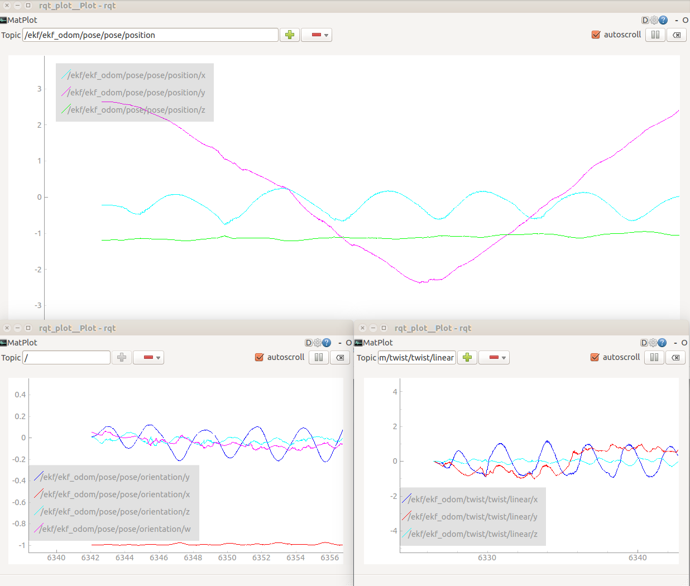

# ELEC5660 Introduction to Aerial Robotics: 
# Project 2 Phase 2: EKF

In Project 2 Phase 2, you need to implement the extender Kalman filter on your lecture note 9. This is an individual project, which means you must complete it by yourself.

## Project Requirements

  * Fuse the odometry obtained from your [`tag_detector`](https://github.com/HKUST-Aerial-Robotics/HKUST-ELEC5660-Introduction-to-Aerial-Robots/tree/master/L7-%20Multi-View%20Geometry%202D-2D,%203D-2D,%203D-3D/proj2phase1 "Project 2 Phase 1") with the measurement from IMU.
  * Publishing pose information in the form of [`nav_msgs/Odometry`](http://docs.ros.org/api/nav_msgs/html/msg/Odometry.html "ros nav_msgs/Odometry Message").
  * Plotting position and orientation after filter using [`rqt_plot`](http://wiki.ros.org/rqt_plot "ros rqt_plot" ).
  * Comparing your result with the odometry before filtering.

your code here:
```cpp
//Rotation from the camera frame to the IMU frame
Eigen::Matrix3d Rcam;
void odom_callback(const nav_msgs::Odometry::ConstPtr &msg)
{
    // your code for update
}
void imu_callback(const sensor_msgs::Imu::ConstPtr &msg)
{
    //your code for propagation
}
```


## Tutorial

You will be provided with a ROS package named [`ekf`](https://github.com/HKUST-Aerial-Robotics/HKUST-ELEC5660-Introduction-to-Aerial-Robots/tree/master/L9-%20Kalman%20Filter%20Sensor%20Fusion/proj2phase2/ekf), which is the skeleton code for the filter. You need to implement this project fusing the odometry and acceleration and angular velocity. Actually, this project is the most difficult part of this lecture, we list some tips that useful below, `they are all very important`. 

  The measurement from IMU is in the `{body frame}`( i.e. IMU's frame ), but the pose estimation from your PnP solver is the pose of `{world}` in the `{camera}` frame. The important thing is that this `{world}` frame's `Z-axis` is pointing down. All frames here are a right-hand frame.

  You need calculate </a> and . In the [`tag_detector`](https://github.com/HKUST-Aerial-Robotics/HKUST-ELEC5660-Introduction-to-Aerial-Robots/tree/master/L7-%20Multi-View%20Geometry%202D-2D,%203D-2D,%203D-3D/proj2phase1 "Project 2 Phase 1") package, what you get is  and , and we provide  and  ( relative transformation between camera and IMU ) in the code. Here  means camera, </a> means IMU and </a> means world. You don't need to know the absolute pose of each frame, all you need to care about is only `relative transformations between frames`.


  Be careful about the discontinuous nature in Euler angles when you obtain the Roll, Pitch and Yaw angles from the rotation matrix.

  IMU data is in high frequency (400 Hz) and image data is in low frequency (20 Hz). The timestamp is already synchronized and you can read them from the respecting message header.

  The filter is not very sensitive to your initial value of covariance matrix. But please remember to set a right initial value for your ekf state. And you can try to set a proper value for the gravity( around 9.8 <a href="https://www.codecogs.com/eqnedit.php?latex=m/$s^{2}" target="_blank"></a> but may not be exact).
 
## Reference Results

We half the play rate of the provided dataset in case your hard disk may be stuck when playing a big volume of data, you can change the rate in the launch file, the number behind "-r" is the dataset play rate. Following are some results plotted in `rqt_plot`, the filter is not fine-tuned, but they are correct results.

<p align="center">
  
</p>


Reference Video ( dataset: ekf_A3.bag ):

<a href="https://www.youtube.com/embed/t9fkVI5imTw" target="_blank"></a>


### Dataset

The dataset is uploaded to the cloud drive:

Dataset 1: ekf_A3.bag  
Download link: [`Google Drive`](https://drive.google.com/file/d/1lOyvXUbvCaAWDh5bh6ZYCT9Vha7crga5/view?usp=sharing "Google Drive")   [`百度网盘`](https://pan.baidu.com/s/1d7rWE6 "百度网盘")

Dataset 2: ekf_A3_2.bag  
Download link:[`Google Drive`](https://drive.google.com/file/d/1WNfVuK27iz5JPcYyZIHZU6bHl_8lZSJT/view?usp=sharing "Google Drive") [`百度网盘`](https://pan.baidu.com/s/1c3oWZzM "百度网盘")


